# Solução Teste Engenharia de Dados Itaú


**Diego Magalhães Rodrigues**

Segue minha solução para o desafio para vaga de Engenheiro de Dados no Itaú.


## 1. ETL


Para ETL resolvi adotar uma abordagem simples mas efetiva de um único script realizar a escrita na bronze e silver layers (s3 bucket paths passados via Glue). Ele foi projetado para ser executado via Glue Job e não localmente e como podemos ver nos prints abaixo ele realiza as tranformações e salva particionado usando **anomesdia** conforme solicitados nos requisitos.


## 2. Análise de Dados


A análise de dados sim foi realizada localmente e seus resultados foram:

```
# cod_cliente	count	nm_cliente
# 396	        5	    SARAH ALLEN
# 479	        5	    JASMINE BAUTISTA
# 855	        4	    DAVID PETERS
# 878	        5	    JENNIFER JARVIS
# 925	        3	    CHRISTIAN GATES
```

e:

```
# media_idade_cliente
# 50.70780856423174 -> 51 anos
```


O código pode ser encontrado na pasta **/2. AnaliseDados** desse respositório.


## 3. Desenho de Arquitetura


Conforme solicitado, foi gerado um desenho de uma arquitetura de uma ingestão via CDC a partir de um banco de dados MySQL (RDS) alimentando as ETLs que populam os buckets com dados bronze e silver. Para diminuir custos e adotar uma abordagem focada na AWS optei por usar DMS (Database Management Service), Kinesis Streaming e Firehouse para mover os logs de alteração da tabela clientes no banco até um bucket de landing zone onde esses dados não tratados seriam posteriormente tratados por um job Glue Spark que irá consolidar e sobrescrever a tabela bronze, seguindo a arquitetura medallion.


Posteriormente, glue crawler são schedulados via triggers no EventBridge para popular tabelas acessíveis no Athena com controle de acesso via roles (Administrador, Data Engineer e Data Scientist). Por último, uma view é usada para fornecer dados finais tratados usando o Athena e com possibilidade de materialização num bucket gold.

Todos os componentes dessa arquitetura estão descritos nos arquivos terraforms na pasta **/6. InfraAsCode**. 


### Buckets S3:

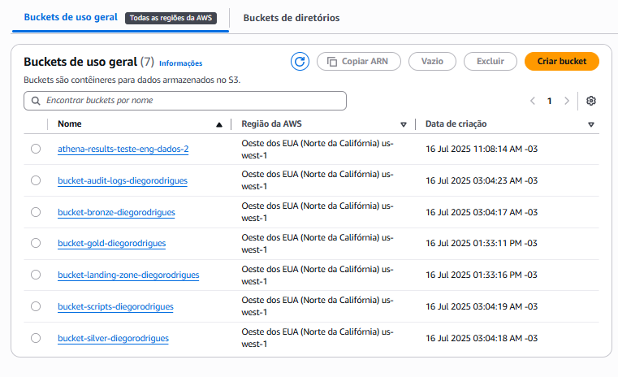

### Glue Jobs:

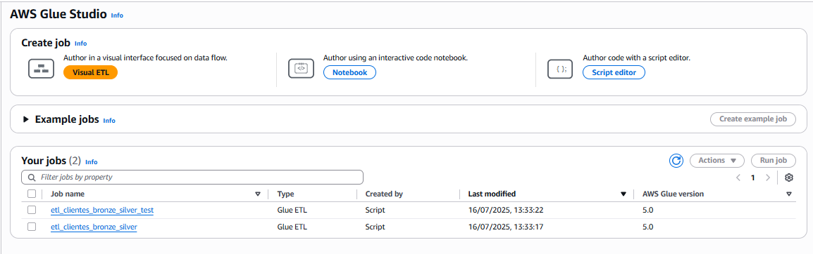

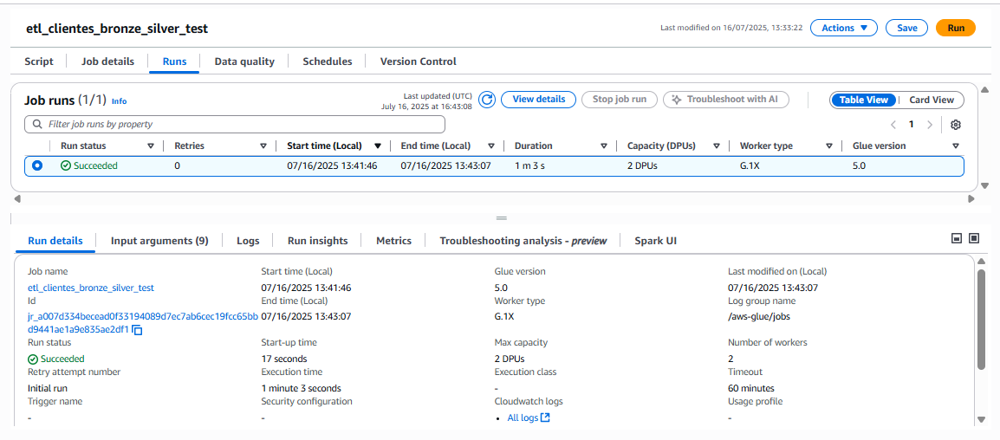

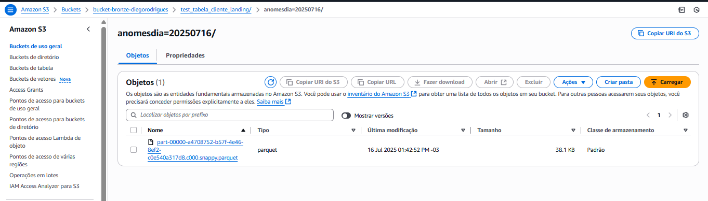


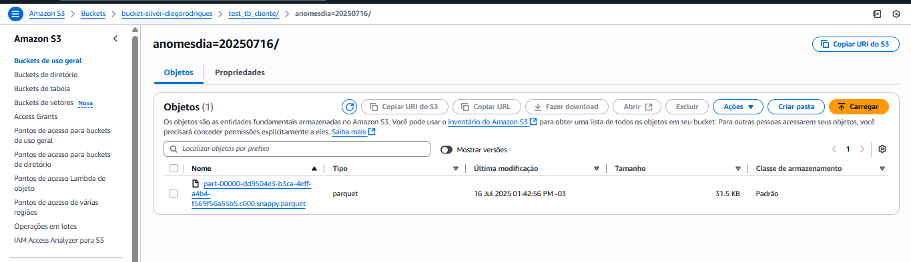


### Glue Crawlers

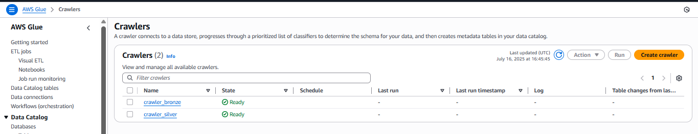

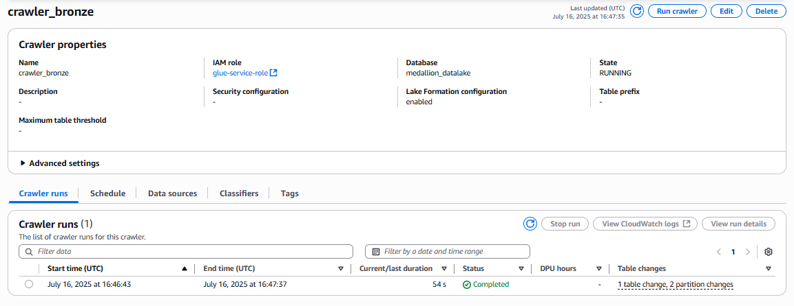

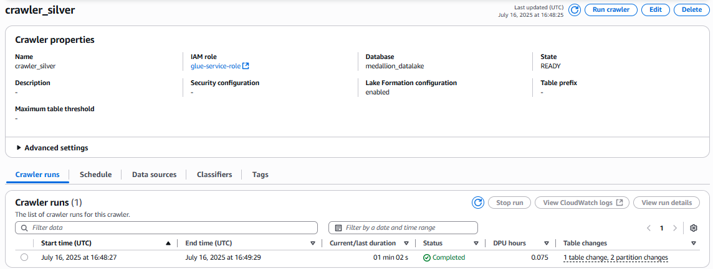


### Athena Tables (Datalake)

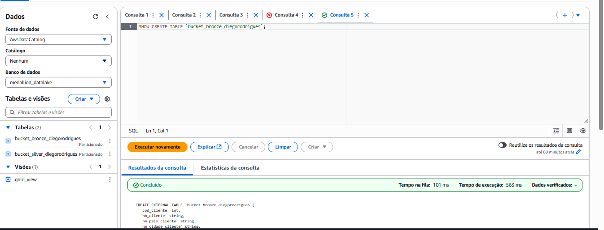


### IAM Roles

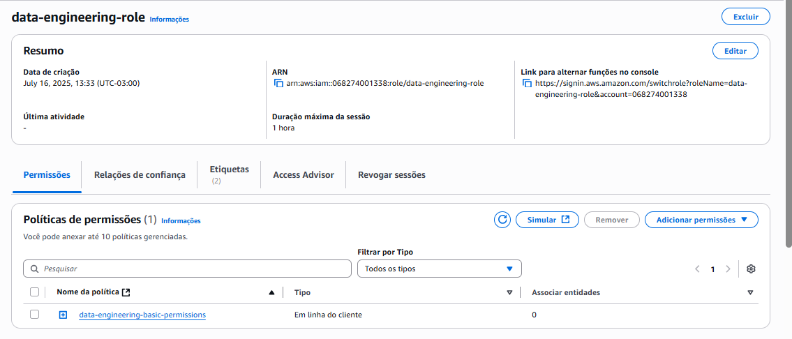

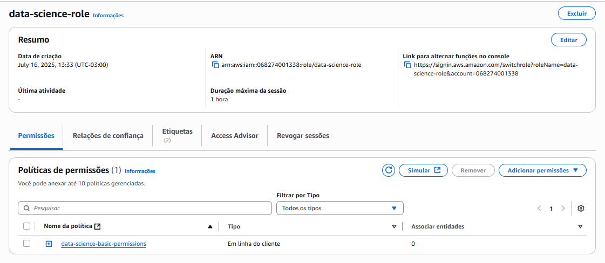

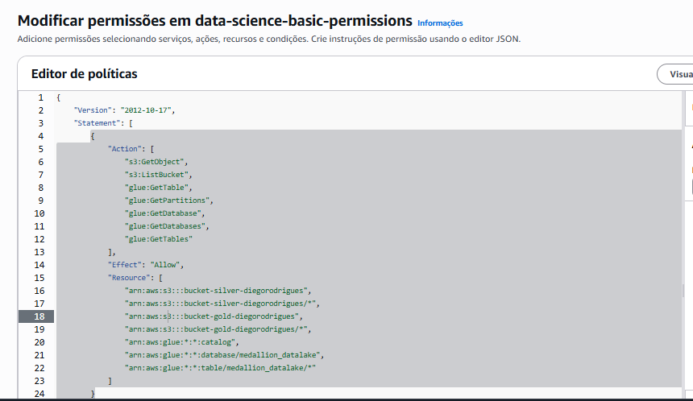


### RDS MySQL and Change Data Capture

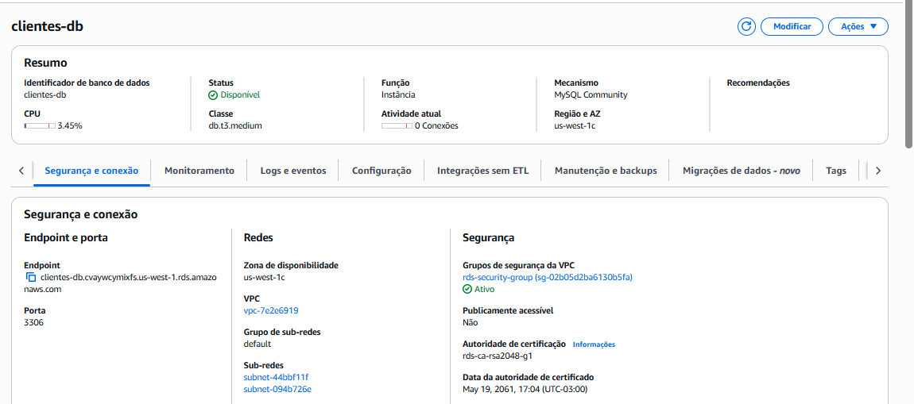

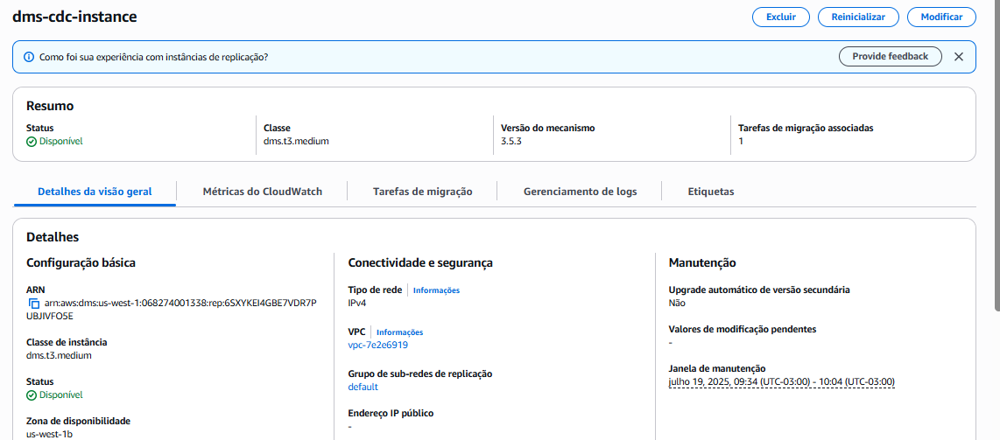


## 4. Data Quality


Foi adotada uma abordagem simples auto-contida num script que gera um relatório json com as métricas de qualidade podendo tanto ser rodado num job glue e posteriormente salvo numa tabela especifica para acompanhamento.


## 5. Teste Unitário


Foi usado um setup simples de testes unitários com **pytest-spark** de forma que não precise de um cluster spark rodando para validar transformações nos dados. Além disso, todas referências ao glue no script foram mockadas para que esses testes possam rodar sem depender de estar num job glue. Assim, ficaria fácil integrá-lo numa pipeline de devops automatizada que rode num container pequeno de forma rápida.


**ps:** estou com alguns problemas de rodá-los na minha máquina local devido o databricks connect que uso diáriamente no trabalho, mas pelo que consegui validar eles devem todos rodar com sucesso.


## 6. InfraAsCode


Tentei colocar o máximo da arquitetura nos arquivos terraforms desde a criação dos buckets, mysql database no rds, conexão do banco com o kinesis via DMS, IAM roles, scripts python necessários para rodar os jobs glue, schedules no Event Bridge do CloudWatch.

Para replicar o ambiente bastar rodar o comando abaixo na pasta:
``` 
terraform apply
```

Como pode ver nos prints abaixo, os recursos foram de fato criados e os jobs estão rodando e criando os dados no formato parquet.


**TODO:** Ainda não consegui criar um script que popule a tabela no banco MySQL e a partir dos logs recriarem a tabela bronze. Para isso, terei que fazer alguns ajustes no meu ETL e eventualmente nos testes. Mas todos recursos estão de pé e rodando normalmente no meu ambiente, todos deployados via terraform, então acredito que o diagrama está condizente e serviria de base para um sistema produtivo.


